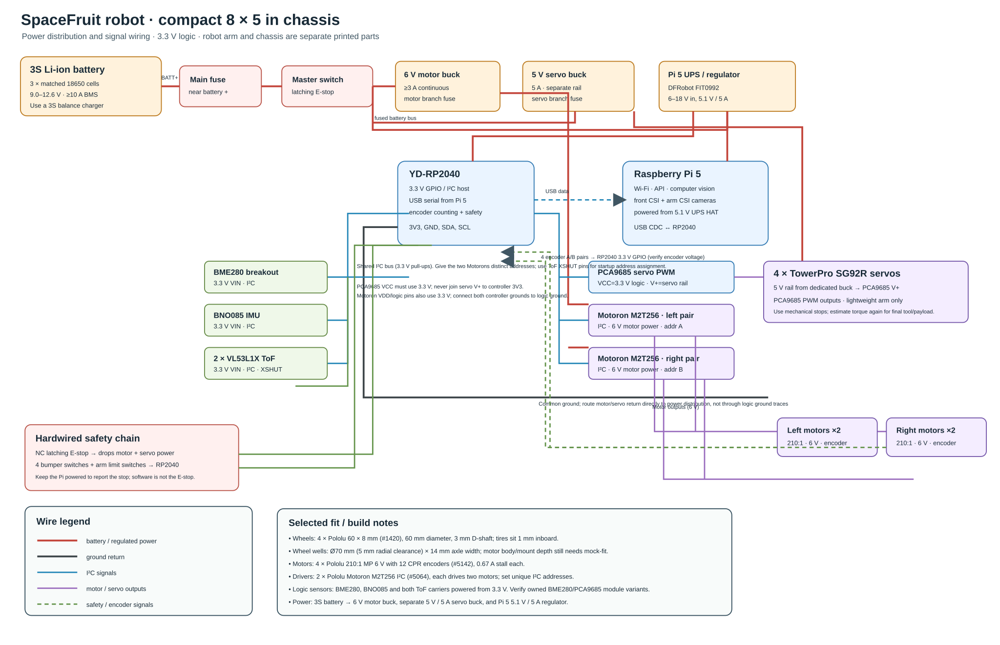

# SpaceFruit compact robot electrical design

This is a component-level prototype wiring plan for the 8 × 5 in chassis. It reflects selected candidate parts and voltage/current ratings, but it is not a fabrication-certified schematic. Before wiring, identify the user's existing motor-driver board and exact BME280/PCA9685 breakouts, confirm battery/BMS and motor current under load, and physically mock-fit every part in the 203.2 × 127 mm shell.

See the [updated high-level electrical architecture](spacefruit-robot-electrical-diagram.svg) for a compact overview.

## Selected compact drive and wheel fit

The editable chassis has an overall bumper footprint of 127 × 203.2 mm; the rounded shell is 196.8 mm long × 72 mm high, open underneath, with ~2.5 mm walls/roof, Pi mounting posts, and a separate arm file. Four Pololu 60 × 8 mm wheels (#1420) match the 3 mm D shafts of four Pololu 210:1 MP 6 V encoder motors (#5142). The wheels are 60 mm diameter; their model pockets are 70 mm diameter and 14 mm wide, placing the tire faces about 1 mm inboard. The pocket gives 5 mm radial and 3 mm per-side axial clearance. Two Pololu Motoron M2T256 I²C boards (#5064) provide two motor channels each, one pair per board; configure distinct I²C addresses. The controller has a 3.0–5.5 V logic range and each channel's rating exceeds the motor's theoretical 0.67 A stall current, but the motor's own stall/thermal constraints still apply.

The selected micro motors are for a light indoor prototype, not a loaded outdoor rover. Their datasheet's stall current/torque are theoretical and a hard stall can damage the gearboxes. Add firmware current/time limits and verify loaded speed/traction before operating near plants. If the user's unknown owned driver is compatible, it may replace the Motorons.

## Signal wiring

| Signal | Connection |
|---|---|
| Pi 5 camera connector 0 | Front Camera Module 3 Wide via a 22-pin Pi 5 to 15-pin camera cable |
| Pi 5 camera connector 1 | Arm Camera Module 3 via second 22-pin-to-15-pin cable with flexible strain relief |
| Pi USB host ↔ YD-RP2040 USB device | USB CDC command/telemetry; use a data cable. Motion MCU fails safe on heartbeat timeout. |
| YD-RP2040 3V3, GND, SDA, SCL | PCA9685 VCC (logic), BME280, BNO085 and both VL53L1X carriers; power all sensor breakouts at 3.3 V and confirm all pull-ups terminate at 3.3 V. |
| YD-RP2040 I²C SDA/SCL | Both Motoron M2T256 controllers and PCA9685. Select separate Motoron addresses. ToF sensors have identical default addresses; keep each XSHUT low, then enable/address one at a time during startup. |
| Motoron M2T256 board A, channels 1–2 | Front-left and rear-left 6 V motors |
| Motoron M2T256 board B, channels 1–2 | Front-right and rear-right 6 V motors |
| Four encoder A/B pairs | Separate RP2040 GPIO inputs; confirm encoder outputs are 3.3 V-safe before connecting. Count edges in interrupt/PIO-safe firmware and close the speed loop. |
| PCA9685 PWM outputs | Four arm servos; PCA9685 VCC = controller 3.3 V, servo V+ = separate fused 5 V supply. Never bridge V+ to 3V3. |
| RP2040 GPIO | ToF XSHUT, bumper switches, arm limit switches, E-stop auxiliary status. Use 3.3 V inputs and pull-ups. |

The Pi 5 handles Wi-Fi, browser/API, task logic, camera capture and high-level vision. The YD-RP2040 handles motion, encoders, limits, and stop handling. BME280 measures robot ambient air, not soil moisture. If the app needs analog soil-moisture data, add a 3.3 V ADS1115 breakout and 3.3 V-output capacitive probe.

## Power wiring

1. Use a matched 3S 18650 Li-ion pack (9–12.6 V) with a BMS rated for at least 15 A discharge, a correct 12.6 V balance charger, and a main fuse placed close to battery positive. Exact fuse ratings depend on measured starts/stalls and wire/connector ampacity.
2. Battery bus feeds three separate branches after the master disconnect and E-stop: a 6 V motor buck; a dedicated 5 V / 5 A servo buck; and a Pi 5 UPS/regulator (DFRobot FIT0992, specified for 6–18 V input and advertised 5.1 V / 5 A output). Do not feed 3S battery voltage into motors, Pi, servos or sensors directly.
3. The 6 V motor rail feeds both Motoron motor-power inputs. The servo regulator feeds only PCA9685 V+. Raspberry Pi documentation recommends 5 V / 5 A for Pi 5 with peripherals; use the regulator's intended Pi connection, and verify it maintains voltage under camera/compute load.
4. Use a normally closed, latching, hardware E-stop relay to remove drive and servo power independently of software. Keep Pi logic powered if desired so it can report a stopped state. Use an auxiliary contact for RP2040 status input. Add fused branches and a manual master disconnect.
5. Join logic grounds (Pi, RP2040, motor-controller logic, sensors and converter returns) at a low-current star point. Route motor and servo current returns directly to the power distribution point, away from logic ground wiring.
6. Protect all boards from water, soil, and conductive debris. Keep buck converters cool and away from camera flex cables. Do not charge lithium cells unattended or use cells of mixed type/age.

## Voltage checks on already-owned boards

PCA9685 is a chip/module family; ensure the board's VCC accepts 3.3 V logic and its SDA/SCL pull-ups do not go to 5 V. Keep its servo-power V+ separate. BME280 modules vary: feed the sensor/breakout with 3.3 V and verify no 5 V pull-ups; a known Adafruit breakout also tolerates 3–5 V on VIN, but this design uses 3.3 V. A bare sensor is not directly breadboard-safe without appropriate breakout circuitry.

## Printing and fit notes

- `spacefruit-robot-concept.scad` is editable CAD in millimetres. For a support-light print, orient the hollow body with the roof on the bed and open underside facing up; check slicer preview around the angled camera pod.
- `spacefruit-robot-body-8x5-print.stl` is the body-only print mesh; it excludes preview wheels and lens disk.
- `spacefruit-robot-assembly-8x5.stl` is a visualization mesh with wheels; do not print the whole assembly as one job.
- `spacefruit-robot-arm-concept.scad` remains a separate arm model.
- Model is still conceptual. It does not yet include verified mount holes for motor brackets, the exact battery holder, driver PCB, cable bend paths, tolerances, sealing features, or a load-rated arm. Use a test print/mock-fit before committing to the final shell.

The machine-readable selected list is in [parts-inventory.json](parts-inventory.json); ownership and verification notes are in [spacefruit-hardware-checklist.md](spacefruit-hardware-checklist.md).

## Manufacturer references

- [Pololu 60 × 8 mm wheel #1420](https://www.pololu.com/product/1420/specs) — 60 mm diameter, 8 mm width, 3 mm D shaft.
- [Pololu 210:1 MP 6 V gearmotor with encoder #5142](https://www.pololu.com/product/5142/specs) — 100 RPM no-load, 0.67 A theoretical stall, 12 CPR encoder.
- [Pololu Motoron M2T256 #5064](https://www.pololu.com/product/5064) — dual-channel I²C driver, 4.5–48 V motor supply, 1.8 A continuous/channel, 3.0–5.5 V logic.
- [Pololu VL53L1X carrier #3415](https://www.pololu.com/product/3415) — 2.6–5.5 V input and level-shifted I²C; feed 3.3 V here.
- [Adafruit BNO085 breakout pinouts](https://learn.adafruit.com/adafruit-9-dof-orientation-imu-fusion-breakout-bno085/pinouts).
- [Adafruit BME280 breakout pinouts](https://learn.adafruit.com/adafruit-bme280-humidity-barometric-pressure-temperature-sensor-breakout/pinouts).
- [TowerPro SG92R product specification](https://www.adafruit.com/product/169) — micro servo, 3–6 V.
- [DFRobot Raspberry Pi 5 UPS/regulator FIT0992](https://www.dfrobot.com/product-2840.html) — 6–18 V input and up to 5 A output. Confirm output voltage/current and fit before integrating.
- [Raspberry Pi 5 hardware documentation](https://www.raspberrypi.com/documentation/hardware/raspberrypi/raspberry-pi-5.html) — power requirements and ports.
- [Raspberry Pi camera documentation](https://www.raspberrypi.com/documentation/accessories/camera.html) — Pi 5 22-pin to camera 15-pin cabling.
